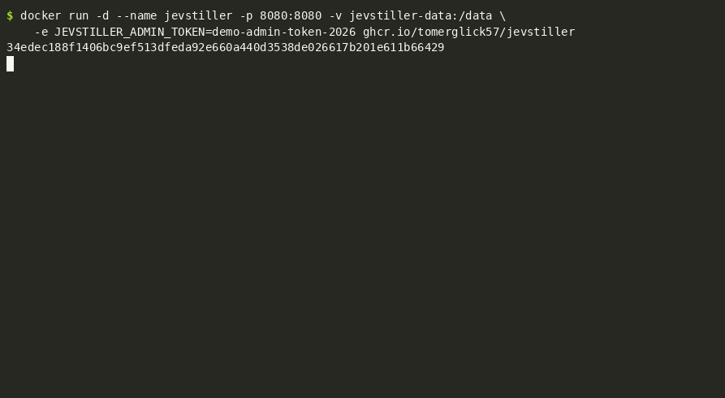

# Jevstiller

**Jev, distilled on the fly.** Put Jevstiller in front of a repeated [Jev](https://docs.typesafe.ai) classification call. At first every request still goes to Jev. From Jev's own answers — with their full probability distributions — it trains a small local model on your traffic, checks that the model agrees with Jev within a budget you set, and then answers most requests itself. Uncertain or novel input, and a permanent random audit slice, keep going to Jev.

Same call. Same answers. Your hardware.

```text
your app ──► Jev                     your app ──► Jevstiller ──► Jev
                                                    │  local model    (only the 3% it isn't sure about,
                                                    ▼                  plus a 2% audit)
                                                 answer
```



You already call Jev. Run Jevstiller next to your service and point the SDK at it; nothing else changes:

```bash
docker run -d -p 8080:8080 -v jevstiller-data:/data ghcr.io/tomerglick57/jevstiller
export TYPESAFE_BASE_URL=http://localhost:8080     # your service keeps its own TYPESAFE_API_KEY
```

The recording above is [examples/proxy_demo.py](examples/proxy_demo.py): 5,000 real customer messages through the unmodified SDK, 8 threads, against live Jev. The local model took over after about 4,000 requests. `docker exec jevstiller jevstiller admin status <task>` shows the audit agreement behind it (with `-e JEVSTILLER_ADMIN_TOKEN=...` on the container).

## Why

Jev is fast, cheap and typed. It is also ~300 ms away, per answer, at every load we tried (16 to 64 concurrent callers, up to 190 requests/s, p50 300 ms), and it is hosted: every classification is a network call to one vendor, under a published limit of 1,200 requests per minute that TypeSafe enforces at its own discretion. Jevstiller is for the workload where that hurts: decisions made one after another (an agent loop, a game tick, classify-then-act pipelines), latency budgets in milliseconds, boxes with no egress, or simply not wanting every classification to depend on one external API.

Against live Jev, in a replay of Banking77 (77 customer-support intents), the local model answered **70.7% of held-out messages at 99.45% agreement with Jev** (target 98%), taking over most live traffic from about 5,000 messages on, and kept Jev's accuracy (78.5% vs Jev's 78.5% on the dataset's labels). A local answer takes ~15 ms on CPU (p50), about 20× faster than Jev; one CPU process answers ~130 messages/s, a GPU ~2,000/s.¹

## The contract

You set one number. Jevstiller returns the label Jev would have returned on at least that share of requests:

```text
target_agreement = 0.98      →  disagreement budget = 2% of all requests
```

The routing threshold is chosen on a held-out, IID calibration set so that, with 95% confidence, the share of requests the local model answers *and* gets different from Jev stays within the budget. It uses an exact finite-sample bound (Clopper–Pearson), testing candidate thresholds strictest-first. It is not tuned by eye, and it is re-verified forever on the audit channel. If the audit shows the contract is broken, everything falls back to Jev automatically.

**Agreement with Jev is not accuracy.** If Jev is wrong, the student is wrong the same way. The status report says so next to every number. See [DESIGN.md §2](DESIGN.md).

## Install

```bash
pip install jevstiller                 # everything: the proxy (`jevstiller serve`), the encoder, the Jev adapter
pip install "jevstiller[gpu]"          # on a GPU machine: adds PyTorch, used automatically when CUDA is present
```

Python 3.10+. CPU works out of the box; a GPU only speeds up the encoder.

## Drop-in proxy: no code changes

Run Jevstiller next to your services and point the Jev SDK at it:

```bash
docker run -d -p 8080:8080 -v jevstiller-data:/data ghcr.io/tomerglick57/jevstiller:0.3.3
# or: pip install jevstiller && jevstiller serve --config deploy/jevstiller.toml
```

```bash
export TYPESAFE_BASE_URL=http://jevstiller:8080     # in each calling service; nothing else changes
```

Services keep their own `TYPESAFE_API_KEY`; Jevstiller forwards it and never stores it.
- **Tasks:** every `Choice` question becomes a task, keyed by its exact instructions, criteria and model, so services asking the same question share one local model.
- **Until a student is ready:** requests are forwarded to Jev unchanged, and Jev's responses returned unchanged, until a task's student is trained and has passed its checks.
- **After that:** the proxy answers what it is sure about in Jev's exact response format (`x-jevstiller-source: local` tells you which), but only for keys Jev has accepted.
- **Always forwarded:** non-`Choice` questions, other endpoints, and anything it does not understand.

Performance of one process (16 vCPU, bge-small on CPU, [docs/benchmarks.md](docs/benchmarks.md)):
- **Forwarded requests:** Jev's latency plus ~1–4 ms, and up to ~585 req/s at 256 concurrent callers.
- **Local answers:** ~16 ms p50, ~50 ms p99, up to the encoder's capacity (here ~150–340 texts/s depending on text length; a GPU raises it). Beyond that, the excess is forwarded to Jev, so the proxy is never much slower than Jev.
- **Memory:** ~300 MB with the encoder, plus a few MB per loaded task. Flat over a 20-minute soak with 18 task reloads a second.

Operations: a TOML config, an admin API and CLI (`jevstiller admin ...`), Prometheus `/metrics`, `/readyz`, JSON logs, `jevstiller backup`, and a Docker image and Kubernetes manifest. Docs: [deploy](docs/deploy.md), [operations](docs/operations.md), [the proxy](docs/proxy.md), [configuration](docs/configuration.md), [security](docs/security.md), [compatibility](docs/compatibility.md). Website: [jevstiller.pages.dev](https://jevstiller.pages.dev).

## How it compares

As of September 2026:

- **[stuntd](https://github.com/bladedevoff/stuntd)** is the closest project. It is also a local Jev-compatible proxy that learns a head per question (on the Laya encoder) and checks 2% of live traffic. The differences:
  - **Guarantee:** Jevstiller picks its threshold with a finite-sample bound on disagreement over all requests; stuntd uses a point estimate on a holdout.
  - **Automation:** Jevstiller trains, shadow-tests and promotes by itself; stuntd uses `stuntd train` / `stuntd enable`.
  - **Training data:** Jevstiller learns from Jev's full probability distributions and gates unfamiliar inputs.
  - **Question identity:** Jevstiller identifies a question by its exact content; stuntd uses its name.
  - **Keys:** Jevstiller answers locally only for API keys Jev has accepted.
  - **Deployment:** Jevstiller serves many tenants from one server, on CPU.
  - **Where stuntd goes further:** it also speaks the OpenAI API, and can answer with no provider at all (zero-shot Laya).
- **[Distil Labs](https://www.distillabs.ai/) and cloud "distillation"** (Amazon Bedrock, OpenAI, Azure) train a small replacement model from your traffic as a separate job, then swap the whole model. There is no per-request fallback to the large model, no bound, and no Jev API.
- **Routers** (RouteLLM, Not Diamond, OpenRouter Auto) choose between existing models. **Semantic caches** (GPTCache, Portkey, [jevcache](https://github.com/hyperspaceai/jevcache)) reuse answers to near-identical inputs. Neither learns to answer new inputs.
- **Open Jev-compatible models** (Laya, Kev, jeff) replace Jev outright, at lower zero-shot accuracy.
- **Research:**
  - OCaTS (EMNLP 2023), Cache & Distil (ACL 2024) and Online Cascade Learning (ICML 2024) train a student online from an LLM's answers, without a guarantee.
  - BARGAIN (SIGMOD 2026) and vCache (ICLR 2026) guarantee agreement with the LLM, but without a student that keeps learning.
  - Jevstiller combines the two, with a permanent audit and automatic fallback on top.

## Quickstart (library)

Without a key, `python examples/quickstart_synthetic.py` runs the whole loop on CPU in half a minute with a synthetic teacher standing in for Jev. With Jev (`TYPESAFE_API_KEY` in your environment):

```python
from jevstiller import Task, Jevstiller, load_encoder
from jevstiller.teachers.jev import JevTeacher

task = Task(
    name="support_router",
    instructions="Which team should handle this customer message?",
    classes={                              # descriptions are sent to Jev verbatim — they are the spec
        "billing":      "Charges, invoices, refunds, payment methods",
        "technical":    "Bugs, errors, integrations, things not working",
        "cancellation": "Wants to cancel, downgrade, or close the account",
        "sales":        "Pre-sales questions, plan comparison, quotes",
        "other":        "Anything that does not fit the categories above",
    },
    target_agreement=0.98,
)

js = Jevstiller(task, teacher=JevTeacher(), data_dir="./jevstiller-data", encoder=load_encoder("base"))

r = js.classify("Please cancel my subscription")
r.label        # "cancellation"
r.confidence   # 0.97
r.source       # "teacher" at first — later "student:v9"

print(js.status().report())
```

```text
Task: support_router   version 89a7438c2f7d   mode: cascade   audit rate 2%
Production: student:v9   Shadow: -
Requests: 11,083   student 69.8%   teacher 30.2%
Agreement with teacher (audit, n=415): 99.40% [98.46%, 99.84%]   target 98%   OK
  note: agreement with the teacher is not accuracy.
```

## How it works

```text
request ─► router ─┬─ confident & in-distribution ─► local student ─► answer
                   ├─ uncertain / novel / 2% audit ─► Jev ─► answer (and a new training row)
                   └─ no model yet ─────────────────► Jev
                                        │
                sample store ◄──────────┘
                     │  train (seconds; frozen encoder + small head, soft targets)
                     ▼
                candidate ─► shadow on live traffic ─► passes the budget? ─► production
                                                                  drift? ─► retrain / fall back
```

- **Encoder**: frozen sentence encoder (`bge-small/base/large`), ONNX or PyTorch. Embeddings are stored, so retraining never re-encodes.
- **Student**: numpy logistic regression on the teacher's *distribution*, early-stopped on a validation slice.
- **OOD gate**: kNN distance in embedding space — unlike anything seen → Jev, whatever the head says.
- **Audit channel**: a fixed random slice always goes to Jev. The only unbiased view of production, and the price of the guarantee.
- **Versions**: immutable `student:vN` directories; promote, roll back, or `export()` a standalone bundle.

The full reasoning — including the five loop bugs the first real replay found and how they were fixed — is in [DESIGN.md](DESIGN.md).

## Status

Alpha. Validated against live Jev (above).
- **Proxy:** the drop-in proxy works end to end with the unmodified TypeSafe SDK.
- **Security:** three security audits (12, 15 and 8 findings, all fixed: [docs/security.md](docs/security.md)).
- **Deployment:** it runs as a hardened container.
- **Tested under failure and load:**
  - Jev down, slow or rate limiting.
  - A full disk.
  - `kill -9` during training.
  - A 40-minute soak with a silent change in Jev's answers, which it recovers from by itself.
  - Load up to 256 concurrent callers.

  Results: [docs/benchmarks.md](docs/benchmarks.md).

See [DEPLOYMENT_PLAN.md](DEPLOYMENT_PLAN.md) for what is done and what is next.

Documentation:
- [DESIGN.md](DESIGN.md): why it works the way it does.
- [docs/deploy.md](docs/deploy.md), [docs/operations.md](docs/operations.md), [docs/proxy.md](docs/proxy.md), [docs/configuration.md](docs/configuration.md), [docs/benchmarks.md](docs/benchmarks.md), [docs/security.md](docs/security.md), [docs/compatibility.md](docs/compatibility.md) (supported SDK and Jev versions, what callers see, versioning).

Not for: tasks with changing class lists (retrain from scratch), non-text input, or volumes too low to ever collect a few thousand examples.

## Reproduce the numbers

Jev's answers for every Banking77 message ship with the repository, so the headline result replays without an API key:

```bash
git clone https://github.com/tomerglick57/Jevstiller && cd Jevstiller && pip install jevstiller
bash experiments/reproduce.sh      # the Banking77 result above, on CPU, 10-15 minutes: 71.9% coverage at 99.50% agreement, deterministic
```

```bash
python experiments/run.py --dataset banking77 --teacher jev --encoder small     # against live Jev (TYPESAFE_API_KEY)
python experiments/run.py --dataset banking77 --teacher oracle --encoder base   # the dataset's labels as a perfect teacher
```

See [experiments/README.md](experiments/README.md).

## Questions and contributing

- **Questions**: [Discussions › Q&A](https://github.com/tomerglick57/Jevstiller/discussions/categories/q-a).
- **You ran it on a real task**: post the status report in [Discussions › Show and tell](https://github.com/tomerglick57/Jevstiller/discussions/categories/show-and-tell) or open a [result report](https://github.com/tomerglick57/Jevstiller/issues/new?template=result.md). This is the most useful thing you can do for the project.
- **Bugs**: [open an issue](https://github.com/tomerglick57/Jevstiller/issues/new?template=bug.md). PRs welcome; see [CONTRIBUTING.md](CONTRIBUTING.md).
- **Security**: see [SECURITY.md](SECURITY.md), not a public issue.

## License

MIT. Jevstiller is an independent project and is not affiliated with, endorsed by, or supported by TypeSafe. "Jev" is their model; this tool only talks to its public API.

---
¹ Live run 2026-09-24: 11,083 replayed messages with 2,000 held out, `bge-small` on CPU; the GPU figure is from an oracle-teacher run with `bge-base` on an RTX 3090. Every number, with its command: [docs/benchmarks.md](docs/benchmarks.md).
