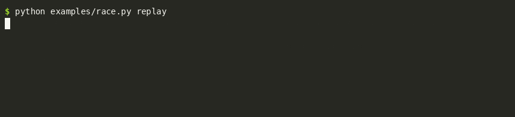

# Benchmarks and measurements

Every number quoted in the README, DESIGN.md and DEPLOYMENT_PLAN.md, with the command that produced it. Unless noted, the machine is a 16-vCPU WSL2 VM (Linux 6.6, Python 3.14, numpy with OpenBLAS). Several runs on 2026-09-24 overlapped with unrelated load on the machine (load averages up to 30); those are marked, and comparisons were made under the same conditions or as medians of interleaved repeats.

## Benchmark

<!-- bench:start -->
### Quality: the loop against live Jev's answers

One replay per task (`experiments/bench.sh`): the dataset's labels are hidden, 2,000 rows are held out, the rest stream through the loop with Jev's recorded answers as the teacher (bge-small on CPU, target agreement 98%, audit rate 2%). Coverage and agreement are measured on the held-out rows against Jev; accuracy is against the dataset's own labels, for Jev alone and for the system (student where it answers, Jev elsewhere). "Local share" is over the whole stream, cold start included.

| Task | Stream | Held-out coverage | Agreement with Jev | Accuracy: Jev / system | Local share | Student path | Jev cost |
|---|---:|---:|---:|---:|---:|---:|---:|
| Banking77 (77 intents) | 11,083 | **71.9%** | **99.50%** | 78.5% / 78.5% | 40% | 111/s | $0.62 |
| CLINC150 (150 intents + other, 12k sample) † | 10,000 | **69.0%** | **99.65%** | 90.1% / 90.1% | 41% | 348/s | $0.83 |
| AG News (4 sections, 20k sample) | 18,000 | **80.2%** | **99.40%** | 88.7% / 88.7% | 64% | 38/s | $0.15 |
| TweetEval sentiment (3) | 57,899 | **22.2%** | **98.70%** | 64.2% / 64.5% | 16% | 114/s | $0.80 |
| TweetEval offensive (2) | 12,100 | **24.1%** | **98.80%** | 73.8% / 74.2% | 20% | 55/s | $0.18 |

† run with `rare_classes = "defer"`: Jev never used one of the task's labels, and the default (`wait`) would have kept the first student from training for the whole stream.

### Threshold rules on the same data

`experiments/baselines.py`: 20 random train / calibration / test splits per task, one head per split, then the confidence threshold is picked on the calibration split by each rule and judged on the test split. Disagreement is the share of *all* test requests the student answered differently from Jev, which is what the 2% budget limits; a violation is a split where it exceeded the budget.

| Task | Rule | Coverage | Disagreement (mean) | Disagreement (worst) | Violations | System accuracy |
|---|---|---:|---:|---:|---:|---:|
| Banking77 (77 intents) | **Jevstiller** (soft labels, bound, OOD gate) | 74.9% | 1.15% | 1.55% | 0/20 | 78.4% |
| Banking77 (77 intents) | hard labels, bound, OOD gate | 71.8% | 1.06% | 1.80% | 0/20 | 78.5% |
| Banking77 (77 intents) | soft labels, point estimate | 79.8% | 1.90% | 2.70% | 9/20 | 78.5% |
| Banking77 (77 intents) | hard labels, point estimate (stuntd's recipe) | 78.2% | 1.81% | 2.65% | 6/20 | 78.6% |
| CLINC150 (150 intents + other, 12k sample) | **Jevstiller** (soft labels, bound, OOD gate) | 78.9% | 1.25% | 1.80% | 0/20 | 91.4% |
| CLINC150 (150 intents + other, 12k sample) | hard labels, bound, OOD gate | 75.6% | 1.26% | 1.70% | 0/20 | 91.6% |
| CLINC150 (150 intents + other, 12k sample) | soft labels, point estimate | 84.3% | 2.09% | 2.85% | 12/20 | 91.3% |
| CLINC150 (150 intents + other, 12k sample) | hard labels, point estimate (stuntd's recipe) | 82.8% | 2.09% | 2.90% | 12/20 | 91.6% |
| AG News (4 sections, 20k sample) | **Jevstiller** (soft labels, bound, OOD gate) | 86.5% | 1.34% | 1.75% | 0/20 | 88.5% |
| AG News (4 sections, 20k sample) | hard labels, bound, OOD gate | 86.1% | 1.35% | 2.00% | 0/20 | 88.6% |
| AG News (4 sections, 20k sample) | soft labels, point estimate | 90.3% | 2.06% | 2.65% | 11/20 | 88.3% |
| AG News (4 sections, 20k sample) | hard labels, point estimate (stuntd's recipe) | 89.9% | 1.96% | 3.05% | 8/20 | 88.5% |
| TweetEval sentiment (3) | **Jevstiller** (soft labels, bound, OOD gate) | 24.0% | 1.46% | 2.10% | 1/20 | 66.1% |
| TweetEval sentiment (3) | hard labels, bound, OOD gate | 24.0% | 1.44% | 1.95% | 0/20 | 66.1% |
| TweetEval sentiment (3) | soft labels, point estimate | 28.2% | 1.99% | 2.60% | 8/20 | 66.2% |
| TweetEval sentiment (3) | hard labels, point estimate (stuntd's recipe) | 27.7% | 1.96% | 2.80% | 7/20 | 66.1% |
| TweetEval offensive (2) | **Jevstiller** (soft labels, bound, OOD gate) | 28.7% | 1.10% | 1.40% | 0/20 | 73.8% |
| TweetEval offensive (2) | hard labels, bound, OOD gate | 28.0% | 1.09% | 1.65% | 0/20 | 73.9% |
| TweetEval offensive (2) | soft labels, point estimate | 36.8% | 1.81% | 2.70% | 6/20 | 74.0% |
| TweetEval offensive (2) | hard labels, point estimate (stuntd's recipe) | 35.7% | 1.83% | 2.55% | 7/20 | 74.0% |

### What the agreement target buys

`experiments/target_curve.py`: each replay's production student, its calibration rows, and the loop's own rule (the bound, with headroom, on the fixed grid) refitted at other targets, then measured on the 2,000 held-out rows. Each cell is held-out coverage at the agreement with Jev actually reached; the last column is the system's accuracy against the dataset's labels across all targets, next to Jev's. `jevstiller admin target <task> 0.95` moves a running task along this curve. The refit uses every calibration row of the version's lineage, where the loop caps them at `max_calib_samples`, so a long stream (TweetEval sentiment) can differ by a few points from the replay table.

| Task | target 99% | target 98% | target 97% | target 95% | target 93% | target 90% | Accuracy (Jev / system) |
|---|---:|---:|---:|---:|---:|---:|---|
| Banking77 (77 intents) | 54% @ 100.0% | 72% @ 99.5% | 77% @ 99.0% | 84% @ 97.5% | 89% @ 96.0% | 93% @ 94.5% | 78.5% / 78.5%–78.8% |
| CLINC150 (150 intents + other, 12k sample) | 50% @ 99.9% | 69% @ 99.7% | 72% @ 99.4% | 82% @ 98.4% | 87% @ 97.5% | 94% @ 95.1% | 90.1% / 89.8%–90.3% |
| AG News (4 sections, 20k sample) | 66% @ 100.0% | 80% @ 99.4% | 87% @ 98.7% | 93% @ 97.5% | 94% @ 97.2% | 97% @ 95.9% | 88.7% / 87.8%–88.7% |
| TweetEval sentiment (3) | 8% @ 99.8% | 18% @ 98.9% | 25% @ 98.3% | 32% @ 97.8% | 40% @ 96.2% | 48% @ 94.6% | 64.2% / 64.3%–65.0% |
| TweetEval offensive (2) | 8% @ 99.8% | 24% @ 98.8% | 32% @ 98.0% | 44% @ 96.2% | 49% @ 95.2% | 56% @ 93.5% | 73.8% / 73.9%–74.5% |
<!-- bench:end -->

What the tables say, read together:

- **The bound holds; the point estimate does not.** Over 100 splits across five tasks, Jevstiller's rule exceeded the 2% budget once (TweetEval sentiment, 2.10%); the point-estimate rule, which is what most local-model recipes use, exceeded it on 6 to 12 of 20 splits per task, by up to a full point. The price is four to eight points of coverage. The soft labels buy two to three points of coverage on the many-class tasks and nothing on the easy ones.
- **Coverage tracks Jev's own consistency, not the task's difficulty.** On the two tweet tasks Jev agrees with the dataset's labels only 64% and 74% of the time, so its answers near the class boundaries are noisy, and a student cannot reproduce noise within a 2% budget: it answers the confident quarter and forwards the rest. The system's accuracy still matches Jev's. The budget is a promise about agreement with Jev, and these tasks show what that costs when Jev itself is unsure.
- **The target is a dial, and accuracy does not move with it.** Going from 98% to 95% roughly doubles what the tweet tasks answer locally (18% → 32%, 24% → 44%) and lifts the intent tasks from ~70% to 82–84%; at 90% the easy tasks answer nearly everything. Across the whole range the system's accuracy against the datasets' labels stays within a point of Jev's, because where the student differs from Jev it is about as often right as Jev was. That is a property of these five tasks, not a law: on a task where Jev is much better than the student at the margin, accuracy would fall with the target.
- **A label Jev never uses blocks the default configuration.** CLINC150 has 151 labels and Jev never answered `reminder_update` in 12,000 messages, so `rare_classes = "wait"` waited for it for the whole stream. With `defer` the loop trains on the classes it has and forwards the rest. Whether the default should change is open.

## Measurements behind the design decisions

The sections below are the engineering log: one measurement per decision, with the command that produced it.

## Live Jev (2026-09-24)

`python experiments/jev_profile.py` → `experiments/results/jev-profile.json`, `tests/fixtures/jev/*.json`

| Concurrency | Requests | p50 | p90 | p99 | Throughput | Errors |
|---|---|---|---|---|---|---|
| 1 | 30 | 299 ms | 353 ms | 764 ms | 3.2 req/s | none |
| 8 | 120 | 288 ms | 330 ms | 793 ms | 24 req/s | none |
| 16 | 240 | 286 ms | 330 ms | 756 ms | 50 req/s | none |

A 5-class question with a one-sentence message used 400 input tokens (instructions and criteria included). The first request of a session took 830 ms.

### Banking77 against live Jev

`python experiments/run.py --dataset banking77 --teacher jev --encoder small --backend onnx --device cpu --tag live-bound`

Jev answers recorded 2026-09-24 (`jev-latest` → `jev-1.13.0`). Replayed 2026-09-25 with the corrected calibration (joint-loss bound, fixed-sequence testing; DESIGN §7.6). The first run, with the flawed rule, got 70.6% coverage at 99.40% agreement, so the correction cost nothing here. bge-small (ONNX, CPU), target agreement 98%, audit rate 2%. 11,083 replayed messages, with 2,000 held out and labelled by Jev for evaluation. All Jev answers are cached in `experiments/cache/banking77.jsonl`, so re-runs are free; the cache ships with the repository (gzipped, completed for all 13,083 messages with `experiments/record_answers.py` on 2026-09-26), and `bash experiments/reproduce.sh` replays it without an API key.

| Measure | Result |
|---|---|
| Held-out: share answered by the student (coverage) | **70.7%** |
| Held-out: system agreement with Jev | **99.45%** (target 98%); selective disagreement 0.78% |
| Live stream: audit-channel agreement | 99.51%, 95% interval [98.48%, 99.91%] (n = 412) → OK |
| Live stream: student share | 0% for the first 1,000 messages, 45% at 3,000, 60% at 5,000, ~67% from 10,000 on (50.8% cumulative) |
| Jev calls | 5,454 for 11,083 messages (5,629 avoided) |
| Cost | $0.38 for the stream; Jev billed ~1,700 input tokens per call (77 class descriptions) |
| Accuracy against the dataset's true labels | Jev 78.5%; the Jevstiller system 78.5% |
| Jev's own confidence | median 0.98; 11.8% of messages below 0.6 |
| Jev latency | 291 ms mean |
| Student path throughput (held-out, CPU) | 129 rows/s, encoder-bound at 7 ms/text on this machine (Jev's published limit: 20 rows/s; measured 190/s, see below) |
| Wall-clock for the whole replay | 11 min |

**Reproduction (2026-09-26).** `bash experiments/reproduce.sh` replays the shipped answers with `--teacher cached`: held-out coverage **71.9%**, system agreement **99.50%**, accuracy against the dataset's labels 78.5% (Jev: 78.5%), 8,666 cache hits and no misses. The replay is deterministic since the train/calibration split is seeded from the config (before, from the store's file path). Four earlier replays of the same stream with different splits gave 66.8–70.7% coverage at 99.45–99.65% agreement: the split moves coverage by a few points, agreement stays inside the contract every time.

With a live teacher, coverage came out higher than with the "oracle" labels and the same encoder (65.7%). A plausible explanation, not tested: a model's labels are more consistent with the surface of the text than human labels, so they're easier to reproduce.

### Jev alone, under load (2026-09-26)

`examples/race.py` lanes straight to `api.typesafe.ai`, one key, the 6-class routing question, real Banking77 messages. The published limit is 1,200 requests/minute; none of these runs saw a 429.

| Callers | Duration | Answered | Rate | p50 | p99 |
|---|---|---|---|---|---|
| 16 | 60 s | 3,169 | 53/s | 296 ms | 421 ms |
| 64 | 20 s | 3,894 | 195/s | 303 ms | 1,187 ms |
| 64 | 60 s | 11,372 | 190/s | 300–336 ms | 430–607 ms (1,833 ms in the first 10 s) |

Jev's latency is flat in concurrency: the argument for a local model is the ~300 ms per answer and the dependency, not the request rate. TypeSafe says its limits adjust dynamically, so another key or another day may see the published limit enforced.

### The sequential race (2026-09-26)

`python examples/race.py run --steps 200` then `replay`. A chain of dependent decisions (an agent loop, a game, classify-then-act) waits for each answer before the next request, so per-answer latency is the whole story, and Jev's does not change with load. The same 200 Banking77 messages and the same 6-class routing question go once to Jev directly and once through a `jevstiller serve` container whose student was trained by the 5,000-message pass of `examples/proxy_demo.py`; the two lanes run one after the other (they share one key and one machine) and the replay draws their recorded timelines on one clock, sped up 3×.

| Lane | 200 decisions | p50 per answer | Answered locally |
|---|---:|---:|---:|
| Jev direct | 60.2 s | 296 ms | – |
| via Jevstiller | **24.7 s** | 16 ms (local answers 14.5 ms, forwarded 313 ms) | 133 of 200 |

2.4× end to end. The 67 forwarded decisions cost 21 of the 24.7 seconds: with a 33% forwarded share the chain cannot get much past 3× no matter how fast the local path is, so the number to push is coverage, not encoder speed. The 20× only shows per local answer. One local answer took 1.8 s (a training pass on the CPU encoder); the rest were under 60 ms.

The task's audit at the end of the session, after 15,000 requests and four student versions: agreement with Jev 97.5% on 161 audited requests, 95% interval [94.4%, 99.1%], against a 98% target. Inconclusive, not broken: the interval straddles the target, so the proxy keeps forwarding what the student is unsure about and keeps auditing. The race above was served by the first two versions, whose audits stood at 100% on 100 and 22 samples.

`python experiments/live_proxy.py --requests 4000 --concurrency 8` → `experiments/results/live-proxy.json`

2026-09-24. A real `jevstiller serve` process (bge-small, `admit_after = 50`, defaults otherwise) in front of the real Jev. The unmodified `typesafe-sdk` sends 4,000 Banking77 messages with one 6-class routing question (cards / transfers / cash / account / fees / other), from 8 threads.

| Measure | Result |
|---|---|
| Errors seen by the SDK | none |
| First local answer | request 3,697: admission (50), then 2,098 train + 503 calibration rows, then 1,010 shadow rows |
| Local share, last 500 requests | 50.4% (the run ended just after the promotion) |
| Promotion | `student:v1`: pooled coverage 83.4%, disagreement upper bound 2.01% against a 2% budget |
| Latency, local answers | p50 15.1 ms, p90 21.5 ms, p99 28.1 ms (n = 252; bge-small on CPU) |
| Latency, forwarded | p50 292 ms, p90 324 ms, p99 393 ms (Jev's own latency plus ~3 ms) |
| Jev cost | $0.067 for 3,698 calls; the task's lineage is `jev:jev-1.13.0` |
| Wall-clock | 140 s |

The engine recorded one teacher answer it could not use (`teacher_errors: 1`), which the SDK still received from Jev unchanged.

## Replays with a perfect ("oracle") teacher

Upper bounds on distillation (the hidden labels play the teacher). `python experiments/run.py --dataset <d> --teacher oracle --encoder <tier>`. Measured before the 2026-09-25 calibration correction. On the live Banking77 replay the correction changed coverage by +0.1 points, so these should be close, but they have not been re-run.

| Dataset | Encoder | Held-out coverage | System agreement | Notes |
|---|---|---|---|---|
| Banking77 (77 classes) | base (GPU) | 70.9% | 99.55% | 2026-09-21, RTX 3090 |
| Banking77 | small | 56.2% | 99.50% | 2026-09-21 |
| Banking77 | large | 59.8% | 99.45% | 2026-09-21 |
| Banking77 | small, CPU ONNX, `ood_max_ref` 50,000 / 5,000 / 1,000 | 65.7% / 65.7% / 65.5% | 98.95% (all) | 2026-09-24; the 50k run keeps every row |
| CLINC150 (151 classes) | small, CPU ONNX, `ood_max_ref` 50,000 / 5,000 | 82.8% / 83.7% | 99.35% / 99.30% | 2026-09-24 |

The small-encoder Banking77 numbers differ between the two dates (56.2% vs 65.7%) because the 2026-09-24 runs use the later loop, with the OOD gate and policy changes of Phase 1–2. The `ood_max_ref` comparison holds everything else fixed.

## Engine concurrency (P1.1)

`python benchmarks/concurrency.py` — 32 callers, one task, a fake teacher that sleeps 50 ms per call.

| | Throughput | p50 | p99 |
|---|---|---|---|
| 0.1.0 (one lock around everything) | 19 req/s | 1,712 ms | 1,730 ms |
| after P1.1 + write-behind store | ~500 req/s | 53 ms | 89–113 ms |

With an instant teacher and 8 callers (Python-bound path): 216 → ~1,900 req/s after the write-behind store, and ~1,750 with background maintenance paced at 1 s (it was 431 unpaced).

## Training vs serving (P1.3)

`python benchmarks/concurrency.py --during-training --rows 15000 --repeats 3` — serving p99 on one task (8 callers) while 5 other tasks train. Median of 3 interleaved runs, 2026-09-24.

| Where the fit runs | p99 slowdown (runs) | 5 fits took |
|---|---|---|
| `train_pool(2)`: 2 low-priority workers, 2 BLAS threads each | ×1.12 (1.01 / 1.34 / 1.12) | ~28 s |
| threads in the serving process, 2 BLAS threads | ×1.11 | ~71 s |
| 5 low-priority workers, 2 BLAS threads | ×2.79 | ~26 s |
| 5 workers, 2 BLAS threads | ×2.93 | ~26 s |
| 5 workers, BLAS uncapped | ×12.1 | ~44 s |

Single runs on this machine varied by 2–4× (other load), hence the medians.

## Many tasks (P2.1)

`python benchmarks/manager.py [--requests 60000]` — 1,000 tasks (clones of one trained task, 384-dim hash encoder), 50 hot tasks get 90% of traffic, `max_loaded=50`, 8 threads, one text per request.

| Stage | Throughput | Hit p50 / p99 | Reload p50 | Peak / end RSS |
|---|---|---|---|---|
| first version | 125 req/s | 16.4 / 77.5 ms | 392 ms | 714 / 594 MB |
| + BLAS capped at 1 thread for serving, maintenance only when something changed | 464 req/s | 2.3 / 7.0 ms | 95 ms | 980 / 766 MB |
| + glibc told to return freed memory (60k requests, 5,600 loads/unloads) | ~550 req/s | 2.8 / 7.5 ms | 100 ms | 1,067 / 441 MB |
| + the cap held on the load path, 2 glibc arenas (2026-09-25, 30k requests, 7,365 loads/unloads) | 207 req/s | 2.4 / 9.0 ms | 113 ms | 313 / 300 MB |

The last row is not directly comparable: before it, `max_loaded` wasn't really held. With the janitor as the only enforcer, loads outran it, and up to 505–666 tasks were loaded at once (peak RSS 2.7 GB when measured with the P6 changes in). The earlier rows' lower reload counts partly reflect that: hot tasks simply stayed loaded. With the cap held, cold traffic evicts hot tasks, so 25% of requests are reloads and throughput is set by reload cost. Size `max_loaded` above the working set.

Hits only, 50 tasks loaded: 340 → 1,210 req/s and p99 80 → 13 ms from the BLAS cap and the maintenance gating. One task alone: 840 → 2,050 req/s. Reopening a task on its own takes ~4 ms (0.4 ms store, ~3 ms model files); first opens, which create the store, ~15 ms alone and ~210 ms under this load. The churn peak (the P2.1 open item) is explained and fixed: see the last row.

## Proxy (P3)

Local stub upstream, SDK over HTTP, sequential, 400 requests:

| Path | p50 | p99 |
|---|---|---|
| SDK → stub directly | 0.94 ms | 1.20 ms |
| SDK → proxy → stub (forwarded) | 4.02 ms | 5.09 ms |

`jevstiller serve` end to end (real CLI, process-pool training, hash encoder, fake Jev): 1,631 of 6,000 sequential requests answered locally within 21 s, no errors.

## Load (P6.4)

`python benchmarks/load.py --encoder small --concurrency 16 64 256 --seconds 30` → `experiments/results/load.json`

A real `jevstiller serve` process (bge-small, ONNX on CPU) in front of a fake Jev in its own process, which answers after ~290 ms (lognormal), like the real one. The load comes from closed-loop async clients: each connection sends its next request as soon as the last returns, with at most 64 connections per client process. Three scenarios, each on a fresh server that is warmed up (trained) first:

- **forward:** nothing admitted, so everything goes to Jev.
- **local:** one trained question.
- **mixed:** 20 questions, Zipf-distributed.

Latency is the server's own measurement (its access log). The clients share the 16-vCPU machine with the server and with ONNX Runtime, which takes every core when the encoder is saturated, so from 64 callers on their own measurements are inflated (at 64 callers, local answers: client p99 2.2 s against server p99 0.2 s).

| Scenario | Callers | Throughput | Local share | Local answers p50 / p99 | Forwarded p50 / p99 |
|---|---|---|---|---|---|
| forward | 16 | 54 req/s | — | — | 294 / 415 ms |
| forward | 64 | 215 req/s | — | — | 294 / 417 ms |
| forward | 256 | 585 req/s | — | — | 406 / 562 ms |
| local | 16 | 126 req/s | 64% | 16 / 50 ms | 311 / 435 ms |
| local | 64 | 130 req/s | 63% | 25 / 201 ms | 341 / 562 ms |
| local | 256 | 424 req/s | 23% | 348 / 436 ms | 519 / 994 ms |
| mixed | 16 | 73 req/s | 31% | 11 / 37 ms | 307 / 423 ms |
| mixed | 64 | 209 req/s | 29% | 84 / 172 ms | 381 / 525 ms |
| mixed | 256 | 367 req/s | 11% | 346 / 438 ms | 560 / 1,037 ms |

What it shows:

- **Forwarding adds ~1–4 ms** up to 64 callers. At 256 callers one process forwards ~585 req/s, which is 30 keys' worth of Jev's published 1,200 requests/minute limit (and three times what one key actually sustained on 2026-09-26, below).
- **The local path is bounded by the encoder:** bge-small on this CPU embeds ~150 of these synthetic texts a second (~340/s for short English sentences). Below that, local answers take 11–25 ms p50. Above it, backpressure (`max_encoder_wait_ms`) sends the excess to Jev, so throughput keeps rising with load (424 req/s at 256 callers) instead of collapsing. At 256 callers the machine is CPU-bound, and local answers slow to ~350 ms, still no slower than Jev.
- **The local shares here are not meaningful:** a language-model encoder can't make sense of the synthetic `w123` vocabulary, so fewer answers pass the confidence gate than with real text (compare the live Banking77 run).
- **Found and fixed on the way:**
  - Forwarding collapsed to ~70 req/s at 256 callers (a single httpx pool of 256 connections; now pools of 16).
  - Past the encoder's capacity, latency grew to 15 s p99 and throughput halved (now backpressure).
  - Requests that were only forwarded were still being encoded (now lazily, only for tasks).
  - The load generator itself hit the same httpx limit, so it now spreads its connections over processes.

## Soak (P6.6)

`python benchmarks/soak.py --minutes 40` → `experiments/results/soak.json`

A real `jevstiller serve` process (hash encoder) in front of a fake Jev (50 ms). Traffic runs at 100 requests/s over 20 questions with Zipf-distributed popularity, from 3 API keys. `max_loaded = 12` is deliberately below the 20 active questions, so tasks load and unload ~18 times a second. At the midpoint, the fake Jev silently rotates its labels (same model name, same difficulty, every answer different).

**Drift and recovery.** The final run (2026-09-25, all fixes in): 40 minutes, 240,246 requests, no errors, no 5xx, ~1,050 task reloads a minute.

| Time | Local share |
|---|---|
| 2 / 4 / 8 / 14 min | 41% / 55% / 70% / 84% |
| drift at 20:00 | students keep answering for ~50 s, now against the new teacher |
| +50 s → +81 s | tasks fall back as their audits confirm the break (19 `fallback` events, 18 `suspicious`); low 19% |
| +2.7 / +12 min after the drift | 50% / 80% again, from students trained only on post-drift answers |
| end | 85% (85% before the drift) |

The detection lag is the price of catching a *silent* change through a 2% audit: until the audit window confirms the break, the students serve answers the new teacher would not give. Here that lasted about a minute. An earlier run, before the load-path fixes, took ~3.5 minutes for the last task (the tail tasks see few audits). A change Jev *announces* (a new resolved model name) needs no audit: 20 answers from the new model switch the lineage (§7.12).

**Memory.**
- **The leak (found and fixed):** reference cycles kept every unloaded task's arrays alive, reaching 555 MB after 4 minutes and still accelerating.
- **After the fix:**
  - **The final 40-minute run:** 90 MB at the start, 182 MB at the end, with one momentary peak of 304 MB. The models themselves held 33–50 MB. RSS minus model memory grew +3 MB/h in the first half and +40 MB/h in the second.
  - **A 20-minute run without drift:** 159 MB at the end, with −10 MB/h in its second half.
  - **One earlier 40-minute run** (after the leak fix, but before the upstream-pool and load-path changes) reached 506 MB with ±100 MB swings. That did not reproduce.
- **A 30-minute confirmation run after the last fixes** (the `max_loaded` cap held on the load path, 2 glibc arenas): peak 222 MB, end 191 MB. The drift was recovered by itself (low 30% at +71 s, 50% again at +3 min). From minute 21 on, a backup of the WSL disk was running. The harness and the server stalled together for seconds at a time. Linux's pressure stats showed every task blocked on disk I/O ~21% of the time over five minutes, with CPU pressure at zero. With ~1,000 task reloads a minute, each reading files, disk stalls became request stalls. That stretch is inconclusive, and the earlier 40-minute runs had no such stalls. (Another reason to size `max_loaded` above the working set: a loaded task serves from memory, and the sample store's writes are queued, so slow disks then matter much less.)
- **Two forwarded requests in 180k got 502** (`ReadError`). This is a keep-alive race: the fake Jev closes idle connections after 5 s, which is also httpx's reuse limit. The SDK retries 502s. Whether real Jev's longer keep-alive avoids it is open.

**The 24-hour run** (`--minutes 1440 --rate 100`, started 2026-09-25 14:25). The server under test predates commit 3fd81da (the security-audit-run-2 fixes) and every release since 0.2.0. Numbers are from the monitor's log; the driver hung in its teardown after the 24 hours and never wrote `soak.json`.

- **Requests:** 3,629,095 over 8,425 ten-second windows; 785,823 task loads (~9 a second).
- **Errors: 436 (0.012%)**: 383 client read timeouts, 37 × 504, 14 connect timeouts, 1 × 502, 1 read error. None in the first 12 hours. They sit in windows between hours 12 and 24 that coincide with other work on the same 16-core box (replays and 64-caller Jev load tests for the benchmarks); the worst window had 64 timeouts in ten seconds. The driver itself, one Python process that also hosts the fake Jev, could not hold 100 requests/s whenever the machine was busy: 38% of the windows ran below 80 requests/s.
- **Memory is bounded, not flat.** Server RSS: ~300 MB through hour 5, a hump to a peak of 654 MB at hour 11 (training workers at 570–690 MB in the same hours), back under 410 MB from hour 18 and **308 MB at the end**, with no restart. The models held 100–170 MB throughout. The hump coincides with the busiest training hours and the external load; that is a correlation, not a cause found.
- **Drift at hour 12:** local share 90% before. Students kept answering for ~3 minutes, then the audits confirmed the break: **9% local at +3.5 min**, 50% again at +8.6 min, 80% at +32 min, 90% at +49 min, and 92–94% for the remaining 11 hours. Slower than the 40-minute run above (50% at +2.7 min): each task had twelve hours of pre-drift data to age out, and the box was busy.
- **Disk was not bounded.** The data directory grew to **53 GB** in the 24 hours:
  - **31.7 GB of stored requests.** Every request was a row of ~4 KB (2 KB of it the 512-dim embedding), and no row was ever deleted: text retention only blanks the text. Fits read only the newest 50,000 rows.
  - **23 GB of model versions**: 2,515 of them, up to 10 MB each (the OOD reference set). Every superseded version stayed on disk.
  - **Why so many versions:** the retrain trigger counted every new row, not every new Jev answer. In the busiest task's last 20,000 rows, 97% were answered locally, so each retrain had ~60 new answers to learn from, and the task stored a new version every ~2 minutes (645 in the day).
  - **Since fixed:**
    - the trigger counts teacher answers;
    - only the newest `keep_versions` (3) versions of each finished state keep their files;
    - the store deletes the rows nothing reads any more (docs/configuration.md, `keep_local_rows`).

    Run over the soak's data, the fixes take it from **53 GB to 4.3 GB**: 20 stores of 23k–73k rows each (294 MB for the busiest, down from 8.4 GB) and 0.9 GB of versions. Clearing the backlog deleted 6.8 million rows in 18 minutes of 20,000-row steps, then rebuilt each store once, in 3–16 s. The status totals were unchanged.
- **Open:** repeat on current code, on an otherwise idle machine, to attribute the memory hump and the timeouts.

## Chaos (P6.5)

`pytest tests/test_chaos.py`. The expected behaviour is written in docs/operations.md, "Common situations".

| Failure | Observed |
|---|---|
| Jev unreachable, after training | Local answers continue; forwarded requests get 502 (Jev-style body); nothing recorded as a teacher answer; recovers when Jev returns |
| Jev slow (3 s, 1 s timeout), 16 callers stuck on it | Forwarded requests get 504; local answers p95 < 250 ms meanwhile |
| 429 storm on one key (100 requests, 8 at a time) | Jev saw ≤ 8 of them; the proxy answered the rest with 429 + `retry-after`; another key unaffected; local answers for the limited key continue |
| Disk full (every write fails) | Every request answered; 200 records dropped and counted in `jevstiller_store_dropped_records_total`; one log line a minute; recording resumes with space |
| `kill -9` three times during training, restart | Comes up each time; `integrity_check` ok; no staging directories left; still learns to answer locally; no orphaned training workers (fixed: they used to outlive the server) |

## Concurrency (P6.3)

`pytest tests/test_concurrency_many.py`: 16 threads over 12 tasks with `max_loaded = 3`, so tasks reload under load while training. Every item is recorded exactly once per task, nothing stays checked out, and at most 3 stay loaded. Through the proxy: 300 concurrent async clients on 3 questions and 2 keys (neither verified at the start), all answered with well-formed 200s, and the rows per task equal the requests.

## Test harness note

Pre-binding a listening socket for uvicorn without `TCP_NODELAY` adds a ~40 ms Nagle/delayed-ACK stall to every request. uvicorn's own sockets (what `jevstiller serve` uses) are not affected. The test helper sets the option.
