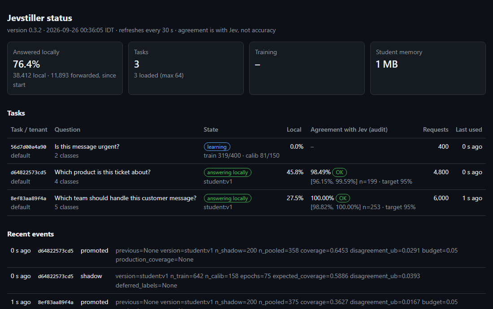

import { Tabs, TabItem, Aside } from '@astrojs/starlight/components';

Jevstiller runs as one service next to yours. Your services keep the TypeSafe SDK and their own Jev keys; only the
base URL changes.

## 1. Run it

<Tabs syncKey="install">
<TabItem label="Docker">

```bash
# an admin token, for the status page and admin commands
export JEVSTILLER_ADMIN_TOKEN=$(openssl rand -hex 32)
docker run -d --name jevstiller -p 8080:8080 \
  -v jevstiller-data:/data -e JEVSTILLER_ADMIN_TOKEN \
  ghcr.io/tomerglick57/jevstiller:0.3.4
```

The image runs on CPU with the encoder built in, and needs no network except to Jev.

</TabItem>
<TabItem label="Docker Compose">

```bash
git clone https://github.com/tomerglick57/Jevstiller
cd Jevstiller
# an admin token, for the status page and admin commands
openssl rand -hex 32 > deploy/admin-token.txt
docker compose up -d
```

The settings are in `deploy/jevstiller.toml`. Your other services on the same Compose network reach it at
`http://jevstiller:8080`.

</TabItem>
<TabItem label="Kubernetes">

```bash
kubectl create secret generic jevstiller \
  --from-literal=admin-token=$(openssl rand -hex 32)
REPO=https://raw.githubusercontent.com/tomerglick57/Jevstiller/v0.3.4
kubectl apply -f $REPO/deploy/kubernetes/jevstiller.yaml
# to try it from your machine:
kubectl port-forward svc/jevstiller 8080:8080
```

One replica with a volume for its data; services in the cluster reach it at `http://jevstiller:8080`.

</TabItem>
<TabItem label="pip">

```bash
pip install jevstiller      # Python 3.10+; GPU: "jevstiller[gpu]"
export JEVSTILLER_ADMIN_TOKEN=$(openssl rand -hex 32)
jevstiller serve --data-dir ./jevstiller-data
```

</TabItem>
</Tabs>

Every setting has a working default. For a real deployment (a config file, who may call it, TLS), see
[Deploy](/proxy/deploy/) and [Configuration](/reference/configuration/).

## 2. Check it works

```bash
curl -s localhost:8080/readyz
```

```json
{"ready":true,"checks":{"manager":true,"encoder":true}}
```

Then send it a real question, with your Jev key:

```bash
curl -si localhost:8080/v1/systemone \
  -H "Authorization: Bearer $TYPESAFE_API_KEY" \
  -H "Content-Type: application/json" \
  -d '{"state": "My invoice is wrong",
       "model": "jev-latest",
       "questions": {"team": {
         "type": "choice",
         "instructions": "Which team handles this?",
         "criteria": {"billing": "", "technical": "", "other": ""}}}}'
```

```text
HTTP/1.1 200 OK
x-jevstiller-source: upstream
x-jevstiller-detail: {"team":"key_unverified"}
...
{"model":"jev-1.13.0","answers":{"team":{"choice":"billing", ...
```

Jev answered (`upstream`), and Jevstiller passed its answer through unchanged. `key_unverified` means this is the
first time it has seen your key: from now on, Jev has accepted it.

## 3. Point your services at it

```bash
export TYPESAFE_BASE_URL=http://localhost:8080
# from other containers: http://jevstiller:8080
```

That's the whole change. Code like this keeps working as it is:

```python
import typesafe_sdk as ts

# reads TYPESAFE_API_KEY and TYPESAFE_BASE_URL
client = ts.TypeSafeClient()
r = client.system_one(
    state="Please cancel my subscription",
    questions={"team": ts.Choice(
        instructions="Which team should handle this message?",
        criteria={
            "billing": "Charges, invoices, refunds",
            "technical": "Bugs, errors, things not working",
            "cancellation": "Wants to cancel or downgrade",
            "other": "Anything else",
        })},
)
r.choices["team"].choice    # "cancellation"
```

## 4. Watch it learn

At first, every request goes to Jev with the caller's key, and Jev's answer comes back unchanged.
- **A question becomes a task** once it has been asked 50 times (`admit_after`); from then on, each Jev answer is a
  training row.
- **A student is trained** in the background once there are enough rows per class, then tested on calibration
  data and in shadow on live traffic.
- **Local answers start** once the student meets the agreement budget. Requests it isn't sure about still go to Jev,
  and so does a random 2%, to keep checking.

Open **http://localhost:8080/jevstiller/status** in a browser and log in with any user name and the admin token as
the password:



Or from a terminal, next to the server:

<Tabs syncKey="install">
<TabItem label="Docker">

```bash
docker exec jevstiller jevstiller admin tasks
docker exec jevstiller jevstiller admin status <task key>
```

</TabItem>
<TabItem label="Docker Compose">

```bash
docker compose exec jevstiller jevstiller admin tasks
docker compose exec jevstiller jevstiller admin status <task key>
```

</TabItem>
<TabItem label="Kubernetes">

```bash
kubectl exec deploy/jevstiller -- jevstiller admin tasks
kubectl exec deploy/jevstiller -- jevstiller admin status <task key>
```

</TabItem>
<TabItem label="pip">

```bash
jevstiller admin tasks                # every task, with its key
jevstiller admin status <task key>
```

</TabItem>
</Tabs>

```text
Task: 3f1c0a9e2b7d44e1a9c2   version 89a7438c2f7d   mode: cascade   audit rate 2%
Production: student:v3   Shadow: -
Requests: 11,083   student 69.8%   teacher 30.2%
Agreement with teacher (audit, n=415): 99.40% [98.46%, 99.84%]   target 98%   OK
  note: agreement with the teacher is not accuracy.
```

The agreement line shows the estimate, its confidence interval, and one of `OK`, `inconclusive` or `BROKEN`; see
[the guarantee](/concepts/guarantee/). For dashboards, `GET /metrics` serves Prometheus metrics
([Operations](/proxy/operations/)).

<Aside title="Nothing answered locally yet?">
That's expected for a while: a question needs 50 requests to become a task, and then enough answers per class
(1,000 rows in all by default) for a first student. A question asked with different wording, classes or model is a
different task. The status page shows how far each task is.
</Aside>

## As a Python library

The engine inside the proxy is also a library, for a single task in your own process:

```python
from jevstiller import Jevstiller, Task, load_encoder
from jevstiller.teachers.jev import JevTeacher

task = Task(
    "support_router",
    "Which team should handle this message?",
    {"billing": "Charges, invoices, refunds",
     "technical": "Bugs, errors, things not working",
     "cancellation": "Wants to cancel or downgrade",
     "other": "Anything else"},
    target_agreement=0.98,
)
js = Jevstiller(task, teacher=JevTeacher(), data_dir="./jevstiller-data",
                encoder=load_encoder("small"))

r = js.classify("Please cancel my subscription")
r.label, r.source   # ("cancellation", "teacher"), later "student:v3"
print(js.status().report())
```

To try the loop with no API key, a synthetic teacher stands in for Jev:

```bash
git clone https://github.com/tomerglick57/Jevstiller
cd Jevstiller
pip install -e .
python examples/quickstart_synthetic.py
```

## Next

- [How it works](/concepts/how-it-works/): the loop, piece by piece.
- [The drop-in proxy](/proxy/overview/): what is answered locally, keys, tenancy, errors and limits.
- [When to use it](/concepts/when-to-use/), and when not to.
